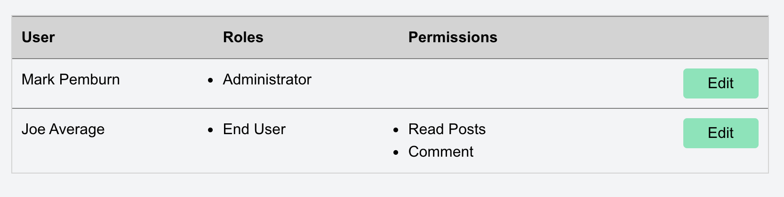

## User Interface for Spatie Laravel Permissions

The **Permissions UI** project shows an approach to creating a User Interface (UI) for the **Spatie Laravel Permissions** package.  You can find that marvelous package here:

https://spatie.be/docs/laravel-permission/v3/introduction

**Permissions UI** was created with Laravel Version 8.x and includes the following packages:
- Laravel Breeze (https://github.com/laravel/breeze)
- Laravel Passport (https://laravel.com/docs/8.x/passport)
- Laravel Collective Forms & HTML (https://laravelcollective.com/docs/6.x/html)

It uses [Larvel Mix](https://laravel.com/docs/8.x/mix) to compile the Javascript and CSS assets. The CSS framework used in the Blade templates is [Tailwind](https://laravel.com/docs/8.x/mix), which is bundled with Larvel Breeze.

### Contents
- [**Installation Notes**](wiki/installation.md)
- [**Getting Up and Running**](wiki/running.md)
- [**Quick Start**](wiki/quick_start.md)
- [**Creating and Editing Role**](wiki/roles_how_to.md)
- [**Creating and Editing Permissions**](wiki/permissions_how_to.md)
- [**Managing User Roles and Permission**](wiki/user_role_how_to.md)

### License

This project is open-sourced software licensed under the [MIT license](https://opensource.org/licenses/MIT).
