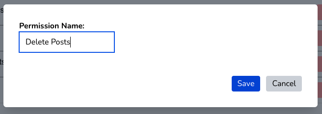
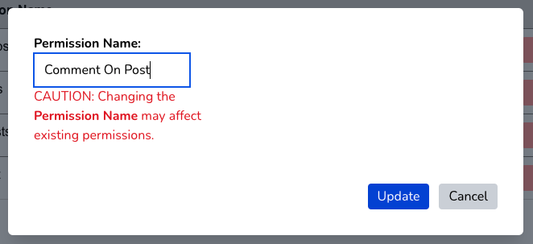

### Creating and Editing Permissions

In addition to roles, you will probably want to create permissions. These allow you to give a finer-grained set of capabilities to your application. Navigate to the **Admin**->**Permissions** menu and you will see this screen:

Clicking on the "Add Permission" button will bring up a dialog box will allow you create a new permission.

Once you've created a permission, you can edit it by clicking on the "Edit" button. Please note that if you change the name of a permission, you can break any existing code that relies on it.

