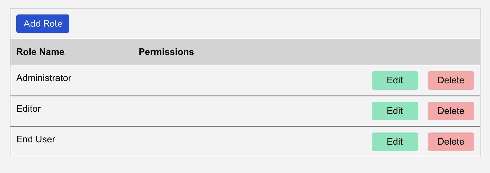
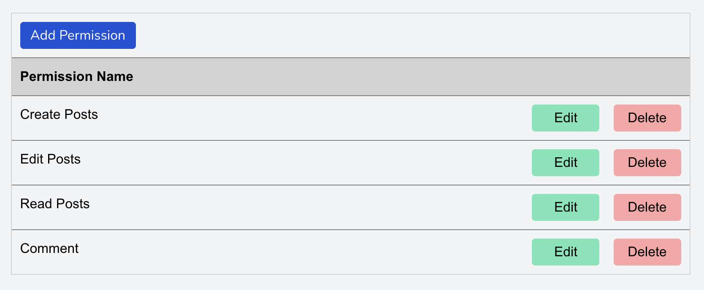

### Quick Start
Assuminng you've followed the procedures in [**Installation Notes**](wiki/installation.md) and [**Getting Up and Running**](wiki/running.md), you should have **Permissions UI** running in your browser.

You should now be able to create a new user account by going to the **Register** link at the upper right corner of the screen (or add `/register` to the URL).  Enter your name, email, and password, and you'll be logged in automatically.

On the **Dashboard**, you'll see the **Admin** menu.  It contains three items: **Roles**, **Permissions**, and **User Roles**. You can create each of these entities manually or, for a quick start, run:

`php artisan quickstart --email=myemail@sample.com`

...replacing the "myemail@sample.com" with the email address you used to create a login account.

Now, if you go to **Admin**->**Roles** on the menu, you should see something like this:

Going to the **Admin**->**Permissions** menu will show you this:

And finally  **Admin**->**User Roles** menu will look like this:

**NOTE**: "Joe Average" was added manually. You can add this to by creating an account for "Joe"/
