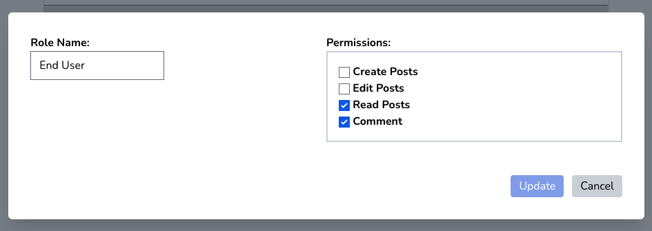
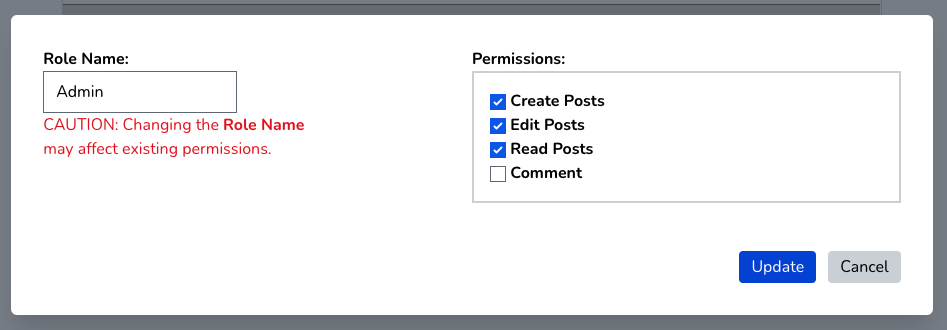

### Creating and Editing Role

The Role is the basic unit of **Laravel-permissions**. Navigate to the **Admin**->**Roles** menu and you will see this screen:

Clicking on the "Add Role" button will bring up a dialog box will allow you create a new role. Any role can have permissions associated with it, and these will appear as checkboxes to the right.  To see how to create permissions, go to [**Creating and Editing Permissions**](permissions_how_to.md).

Once you've created a role, you can edit it by clicking on the "Edit" button. Please note that if you change the name of a role, you can break any existing code that relies on it.  Adding and removing permission will affect the capabilities of users who have been assigned this role.

