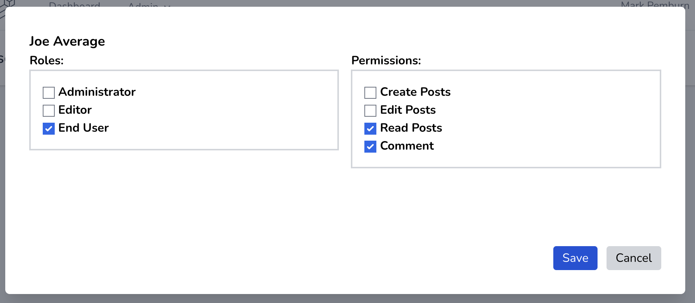
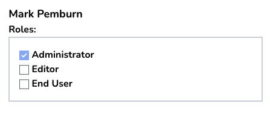

### Managing User Roles and Permission

Once you have roles and, potentially permissions, defined, you'll need to assign these to your users.  Navigate to the **Admin**->**User Roles** menu.  You will see a list of all of your users and any roles or permissions they've been granted.

When you click on the "Edit" button, you'll see this dialog box:

The checkboxes on the left allows you select which role or roles to assign to a user. On the right, you may select specific permissions.  Note that some items are grayed-out.  This means that the permissions are already granted to a role that has been assigned to the user.

**NOTE**: If the current user is an Adminstrator, they _cannot_ remove this role. Otherwise, they would lose the ability to make any further role or permission changes (along with everything else that an Administrator is allowed to do).

